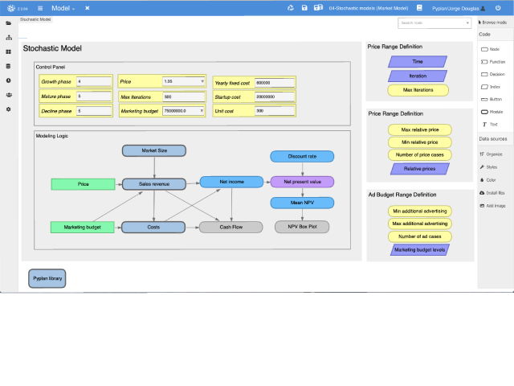
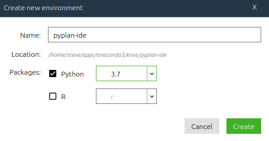
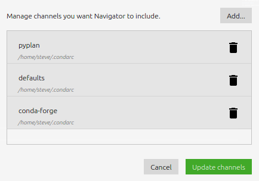
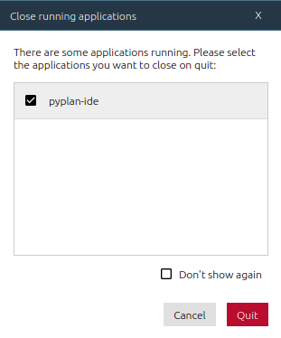

# 

**Pyplan** provides a Python development environment intended for easily creating and deploying data analytics apps. Different than a Jupyter Notebook, where code is structured as a list of sentences, in Pyplan code is contained in nodes that work as calculation steps, organized in a hierarchical influence diagram. Nodes can be evaluated, and its result inspected through a console output or rendered as a table or graph. User interfaces are created dragging nodes on a canvas. Final apps can be shared with one click to general audience.

Among its most prominent features you will find:

- Assisted drag and drop graphical programming
- Visual Influence Diagram to represent logic flow
- Easy creation of interactive user interfaces
- Empowered collaboration by one click publishing and sharing
- Secure and scalable with corporate standards
- On cloud or on-premise deployment

## Screenshots

Influence Diagram



Interfaces (dashboards)


It includes many tutorials, examples and demos


## Requirements

- [python 3.7](https://www.python.org/downloads/release/python-375/)


## Installing and running Pyplan

You can install Pyplan in your computer following the instructions below. In order to publish your apps or run Pyplan online, you will need to [create an account here](https://my.pyplan.org).

### Installing using **Conda**

```bash
# Install
conda config --append channels pyplan
conda config --append channels conda-forge
conda create -n pyplan-ide python=3.7
conda activate pyplan-ide
conda install pyplan-ide

# Run
conda activate
pyplan
```

### Installing using **PIP**

On Linux:

Open the terminal and run this commands:

```bash
# Install
python3.7 -m venv pyplan
. pyplan/bin/activate
pip install --upgrade pip
pip install pyplan-ide

# Run
. pyplan/bin/activate
pyplan
```

On Windows:

Open the command line (CMD) and run this commands:

```bash
# Install
python3.7 -m venv pyplan
pyplan\Scripts\activate.bat
pip install --upgrade pip
pip install pyplan-ide

# Run
pyplan\Scripts\activate.bat
pyplan
```

### Using **Anaconda Navigator**

#### Install

1. Create and select new environment "pyplan-ide" for Python 3.7

    

2. Add `pyplan` and `conda-forge` channels

    

3. Find `pyplan-ide` app on Home section and click Install

#### Important

If doing an upgrade, first restart Anaconda Navigator in order to close any active Pyplan process.

This message will appear, make sure that `pyplan-ide` is selected.



#### Run

- Click launch on **pyplan-ide** app

## User Guide

For User Guide please visit [docs.pyplan.org](http://docs.pyplan.org)

## Community Support

For Community Support please visit [community.pyplan.org](http://community.pyplan.org)
