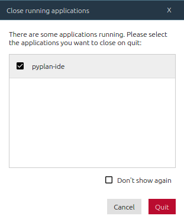

# 

**Pyplan** allows consolidating into a single graphical environment all
corporate Data Analytics and Decision Support needs. It is meant to
simplify Business Analyst introduction to Data Science with Python.

Among its most prominent features you will find:

- Assisted drag and drop graphical programming.
- Visual Influence Diagram to represent logic flow.
- Easy creation of interactive user interfaces.
- Empowered collaboration by one click publishing and sharing.
- Secure and scalable with corporate standards.
- On cloud or on-premise deployment.

## Screenshots

Influence Diagram


Interfaces (dashboards)


It includes many tutorials, examples and demos


## Requirements

- [python 3.7](https://www.python.org/downloads/release/python-375/)

## Installation alterantives

You can install Pyplan in your computer following the instructions below or you can try it online at [my.pyplan.com](https://my.pyplan.com)

### Using **pip**

Linux/Mac:

```bash
python3.7 -m venv pyplan
. pyplan/bin/activate
pip install --upgrade pip
pip install pyplan-ide
```

Windows:

```bash
python3.7 -m venv pyplan
pyplan\Scripts\activate.bat
pip install --upgrade pip
pip install pyplan-ide
```

### Using **conda**

```bash
conda config --append channels pyplan
conda config --append channels conda-forge
conda create -n pyplan-ide python=3.7
conda activate pyplan-ide
conda install pyplan-ide
```

### Using **Anaconda Navigator**

1. Create and select new environment "pyplan-ide"

2. Add `pyplan` and `conda-forge` channels

3. Find `pyplan-ide` app on Home section and click Install

#### Important

If doing an upgrade, first restart Anaconda Navigator in order to close any active Pyplan process.

This message will appear, make sure that `pyplan-ide` is selected.



## Run Pyplan

You can run **Pyplan** with these commands:

Linux/Mac:

```bash
. pyplan/bin/activate
pyplan
```

Windows:

```bash
pyplan\Scripts\activate.bat
pyplan
```

Conda:

```bash
conda activate
pyplan
```

Anaconda Navigator:

- Click launch on **pyplan-ide** app

## User Guide

For User Guide please visit [docs.pyplan.org](http://docs.pyplan.org)

## Community Support

For Community Support please visit [community.pyplan.org](http://community.pyplan.org)
